# ⚽ Desafio do Drible Infinito 🥅

## 1.📖 Sinopse:

**O apito soou e o jogo começou! Assuma o controle do nosso camisa 10, Neymar Jr., em uma corrida infinita alucinante rumo ao sonhado hexa. A ginga brasileira é sua maior arma: drible zagueiros implacáveis, escape dos cones traiçoeiros e fuja dos cartões de um juiz rigoroso que quer te mandar para o chuveiro mais cedo. Agarre Bolas de Ouro para multiplicar sua glória, recupere o fôlego com caneleiras e ative o turbo com isotônicos para deixar a defesa adversária comendo poeira. Você tem habilidade suficiente para levantar a Taça?**

## 2.🚹 Participantes:
* Daniel Cavalcanti Monteiro
* Fernando Corrêa Gambôa Pereira dos Santos
* Leonardo Quintella Mendes Remigio
* Saulo Fabianne de Melo Ferreira Filho
* Theo Bessa da Costa
* Tiago Almeida Rolim Cruz

## 3.🧱 Arquitetura do Projeto:

O jogo foi desenvolvido com a biblioteca Pygame e estruturado de forma modular (sem o uso de subpastas complexas) para melhor organização e facilidade de importação. A estrutura conta com uma pasta assets/ para áudios, prints do jogo e imagens e os seguintes arquivos na raiz:

```text
assets
    ├── audios
    │   ├── clique_botao.mp3        # Som emitido ao clicar em um botão dos menus
    │   ├── musica_menu.mp3         # Trilha sonora do jogo
    │   ├── passar_cima_botao.mp3   # Som emitido ao passar o mouse sobre os botões
    │   ├── som_apito.mp3           # Som emitido ao colidir com um obstáculo
    │   └── som_torcida_menor.mp3   # Som emitido ao colidir com um coletável
    ├── prints_do_jogo
    │   ├── tela_game_over.png
    │   ├── tela_inicial.png
    │   ├── tela_jogo1.png
    │   ├── tela_jogo2.png
    │   ├── tela_jogo3.png
    │   ├── tela_jogo4.png
    │   └── tela_turbo.png
    └── sprites_do_jogo
        ├── bola_de_ouro.png       # Imagem do troféu Bola de Ouro (coletável)
        ├── caneleira_aco.png      # Imagem da caneleira de proteção (coletável)
        ├── cartão_amarelo.png     # Imagem do cartão amarelo (obstáculo)
        ├── cartão_vermelho.png    # Imagem do cartão vermelho (obstáculo)
        ├── cenario.png            # Imagem de fundo do campo de futebol onde o jogo ocorre
        ├── cone.png               # Imagem do cone de treino (obstáculo)
        ├── isotonico.png          # Imagem da garrafa de isotônico (coletável)
        ├── neymar_run_sheet.png   # Folha com a sequência de imagens para a animação de corrida do Neymar
        └── zagueiro.png           # Imagem do zagueiro adversário (obstáculo)
        └── vida.png               # Imagem de coração para representar a vida no HUD
        └── turbo.png              # Texto especial para representar o uso do isotônico
        └── turbo(apagado).png     # Texto especial para representar o uso do isotônico
```

* **main.py:** Controla o loop principal do jogo, gerencia a tela, atualiza os grupos de sprites e calcula as colisões.
* **coletaveis.py:** Define os itens de vantagem (Bola de Ouro, Isotônico/Gatorade e Caneleira), cada um aplicando um bônus único ao jogador.
* **obstaculos.py:** Define a física e o comportamento de diferentes obstáculos (zagueiro, cones e cartões amarelos e vermelhos) com diferentes níveis de dano ao jogador em sua colisão.
* **jogador.py:** Define a classe do jogador, programando sua movimentação, status de invencibilidade e sistema de vidas.
* **menu_inicial.py:** Gera a tela de abertura do jogo, preparando o jogador para a partida.
* **game_over.py:** Gera o plano de fundo da tela "Game Over" para ser mostrado assim que o jogador perde suas vidas.

## 4.📸 Capturas de Tela:
**Tela Inicial:**

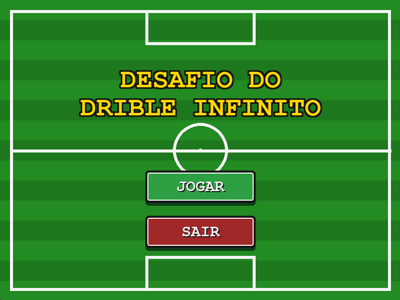


**Gameplay:**

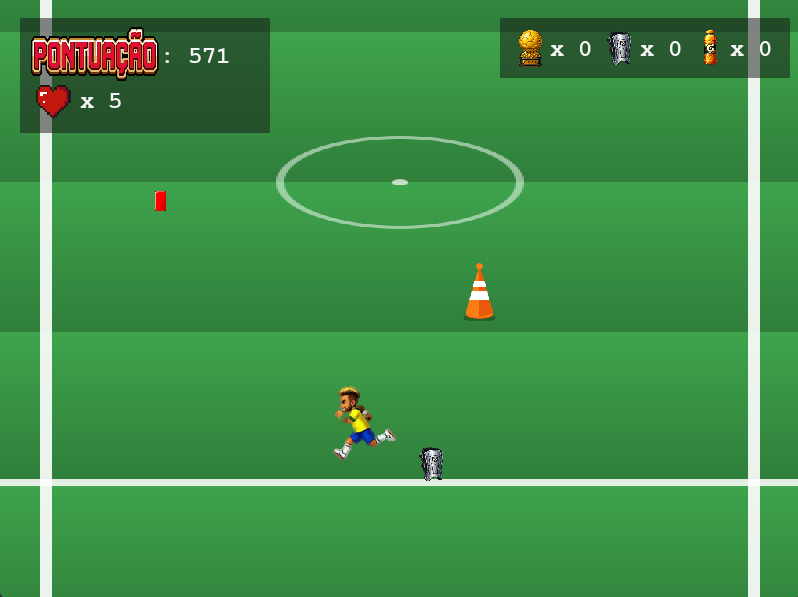

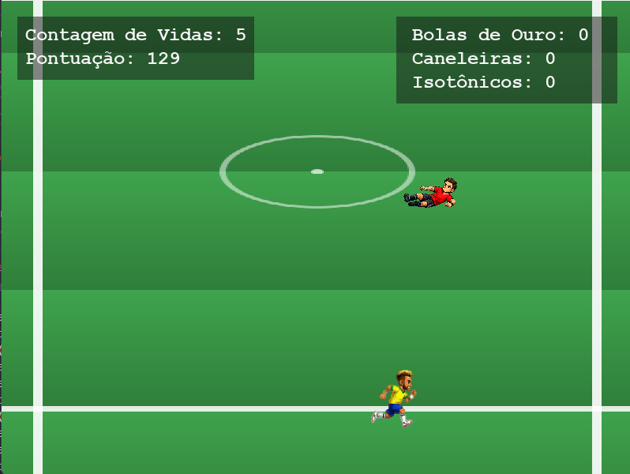

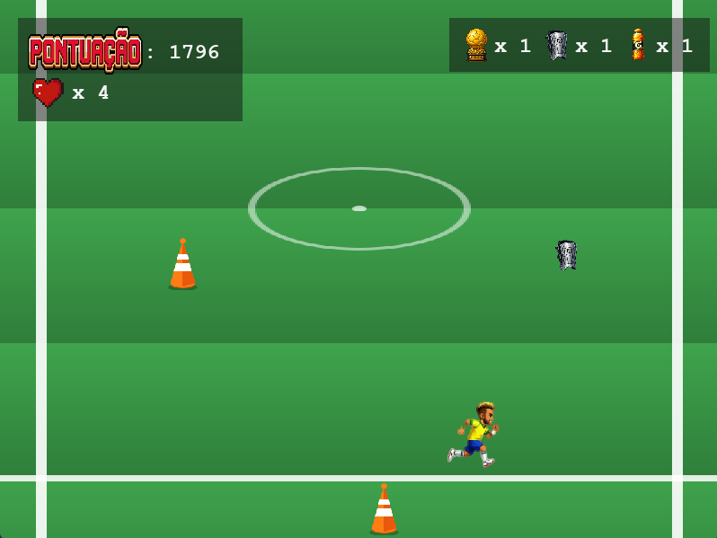

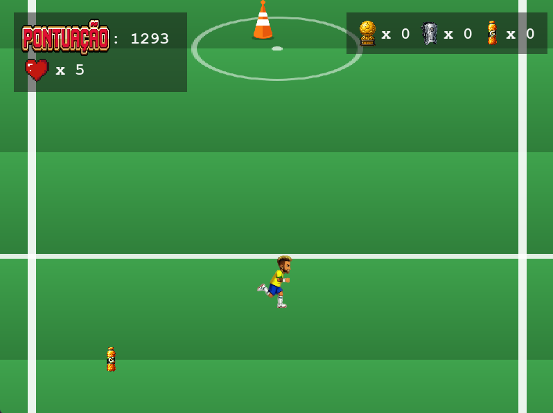

**Tela do Turbo:**

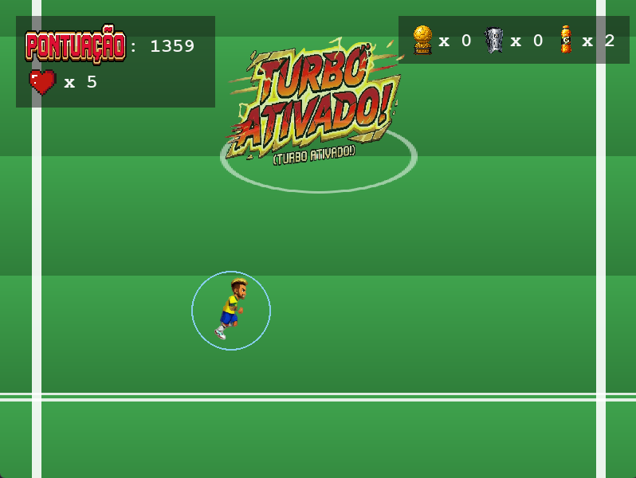

**Tela de Game Over:**

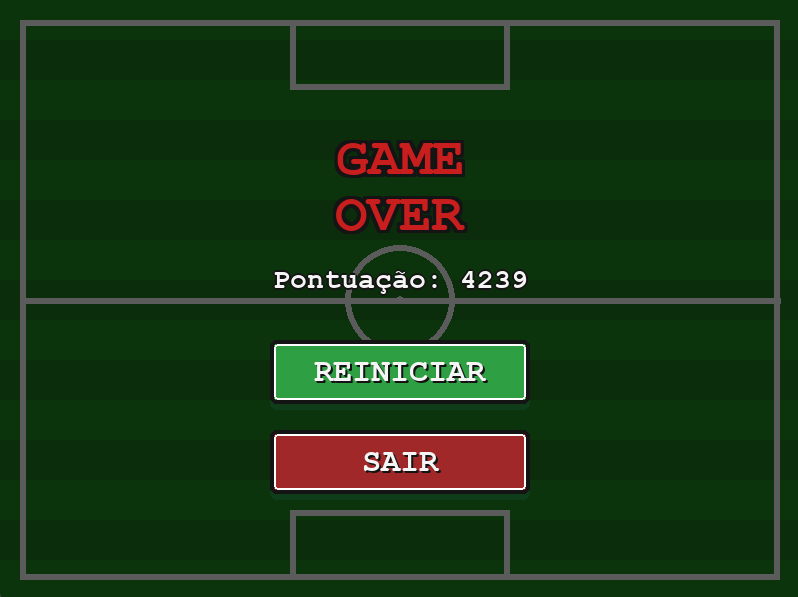

## 5.🛠 Ferramentas, bibliotecas e frameworks utilizados:
* Python 3.12+.
* Biblioteca Pygame: Biblioteca principal utilizada para a construção do jogo, sendo responsável pela criação da janela e do loop principal, pela captura de eventos de teclado e mouse, pela renderização das imagens e formas geométricas e pela reprodução de efeitos sonoros e músicas. O framework também facilitou o gerenciamento das entidades do jogo e permitiu implementar colisões de forma simples e hitboxes ajustadas.
* Random: Biblioteca usada para gerar aleatoriedade principalmente para os obstáculos e coletáveis do jogo.
* Sys: Biblioteca usada para encerrar corretamente o processo do programa, garantindo que a aplicação feche por completo junto com a janela do Pygame.
* GitHub: Usado para versionamento de código, criação de branches e Pull Requests para manter o código seguro durante o trabalho em equipe.
* VS Code: Editor de código utilizado para o desenvolvimento do projeto, facilitando a escrita e organização dos múltiplos arquivos (main.py, jogador.py, obstaculos.py, etc.), a navegação entre eles e a identificação de erros de sintaxe durante a codificação.
* Spritesheet Generator: Usado para gerar as imagens dos sprites do jogo presentes nos assets.
* Pixabay: Usado para criação dos áudios do jogo presentes nos assets.

## 6.📝 Divisão de trabalho: 
* **Daniel Cavalcanti Monteiro:** responsável pela lógica dos coletáveis em coletaveis.py.
* **Fernando Corrêa Gambôa Pereira dos Santos:** responsável pela lógica envolvendo o jogador (vidas, efeitos, movimentação...) em jogador.py.
* **Leonardo Quintella Mendes Remigio:** responsável pelas imagens e sons do jogo na pasta assets.
* **Saulo Fabianne de Melo Ferreira Filho:** responsável pela lógica dos obstáculos em obstaculos.py e pelo README.
* **Theo Bessa da Costa:** responsável pela interface em menu_inicial.py e game_over.py.
* **Tiago Almeida Rolim Cruz:** responsável pela lógica de funcionamento do jogoe do HUD em main.py.

## 7.📚 Conceitos de Programação utilizados: 
Durante o desenvolvimento do projeto, diversos conceitos estudados na disciplina foram aplicados na prática, além da aprendizagem de novos conceitos necessários para a implementação do jogo :
* **Programação Orientada a Objetos (POO):** O sistema foi totalmente estruturado em classes (`Jogador`, `Obstáculo`, `Coletável`, `Botão`, `Menu`, `Game`, `App` e `GameOver`), onde cada uma encapsula seus próprios atributos e métodos.
* **Herança:** Aplicada diretamente nas classes `Jogador`, `Obstaculo` e `Coletavel`, que derivam de `pygame.sprite.Sprite` para reaproveitar a infraestrutura gráfica e de gerenciamento de grupos do Pygame.
* **Polimorfismo e Interface Comum:** Utilizado permitindo que diferentes telas do jogo (`Menu`, `Game`, `GameOver`) implementem os mesmos métodos essenciais (`gerenciar_evento`, `atualizar`, `desenhar`), sendo gerenciadas de forma uniforme pela classe principal `App`.
* **Composição:** Empregada para organizar as responsabilidades, onde a classe `App` contém instâncias das outras telas como atributos, delegando as tarefas em vez de herdar delas.
* **Comandos Condicionais:** Uso extensivo de `if/elif/else` para tomada de decisão, como na classe `Obstaculo`, onde o tipo sorteado define sprite, velocidade e dano de cada instância, e no método `atualizaçao()` da classe `Jogador`, que trata de forma diferente cada tipo de colisão.
* **Laços de repetição**: Uso de `for` e `while` em diferentes contextos: o laço duplo `for linha in range(5): for coluna in range(5)`: em `Jogador` fatia a spritesheet em frames de animação; laços `for` percorrem os grupos de sprites a cada frame para verificar colisões; e o laço `while self.rodando`: implementa o game loop principal da aplicação.
* **Listas**:  Utilizadas para armazenar dinamicamente os frames de animação do jogador (`self.lista_frames`), preenchida via `.append()` dentro do laço de corte da spritesheet.
* **Funções**: Além dos métodos de classe, foram criadas funções independentes reaproveitadas em múltiplos arquivos, como `carregar_fonte()`, que centraliza o carregamento de fontes com tratamento de exceção embutido.
* **Tuplas**: Utilizadas para armazenar dados fixos e imutáveis, como as cores de interface e os conjuntos de tipos sorteáveis de obstáculos e coletáveis, usados em conjunto com `random.choice()`.
* **Máquina de Estados Finita:** Implementada na classe `App` para gerenciar o fluxo do jogo, alternando dinamicamente o comportamento do software entre os estados de Menu, Jogo e  Game Over.
* **Tratamento de Exceções:** Uso de blocos `try/except` para conferir robustez ao sistema, tratando falhas potenciais no carregamento de assets externos (imagens, fontes e arquivos de áudio) e fornecendo caminhos alternativos.
* **Geometria Computacional e Colisões:** Aplicação prática de conceitos geométricos por meio da classe `pygame.Rect`, calculando a sobreposição de caixas de colisão (*hitboxes*) para detectar interações entre o jogador, obstáculos e coletáveis.
* **Eventos e Temporização:** Controle do surgimento síncrono e periódico de elementos na tela através de eventos customizados do Pygame e temporizadores baseados no tempo delta.
* **Matemática Aplicada (Interpolação):** Uso de técnicas de animação baseadas em Interpolação Linear para suavizar as transições visuais de escala e opacidade na interface dos botões.

## 8.📈 Aprendizados e Desafios:
* **Qual foi o maior erro cometido durante o projeto? Como vocês lidaram com ele?**
   * Um dos principais erros enfrentados pela equipe foi o desenvolvimento dos módulos de forma muito independente, sem um alinhamento prévio sobre a interação entre as classes e funções. Isso gerou conflitos de merge no GitHub e pequenas inconsistências que comprometiam a execução do projeto. Para solucionar esse problema, passamos a definir previamente a comunicação entre os módulos e a utilizar Pull Requests menores e mais frequentes, sempre revisados em grupo antes da integração à branch principal, tornando o desenvolvimento mais organizado e reduzindo significativamente os conflitos.

* **Qual foi o maior desafio enfrentado durante o projeto? Como vocês lidaram com ele?**
   * O maior desafio da equipe foi a adaptação às ferramentas e tecnologias utilizadas durante o desenvolvimento. Além de aprender a trabalhar de forma colaborativa com Git e GitHub, enfrentamos dificuldades iniciais para organizar as branches, integrar alterações e evitar conflitos no repositório. Para contornar esses problemas, definimos um fluxo de trabalho mais organizado, com branches por funcionalidade e revisões frequentes dos Pull Requests. Outro desafio importante foi aprender a utilizar a biblioteca Pygame, já que a maior parte da equipe não tinha experiência prévia com desenvolvimento de jogos. Ao longo do projeto, fomos estudando sua documentação e testando suas funcionalidades na prática, o que permitiu implementar os recursos necessários e concluir o jogo com sucesso.

* **Quais as lições aprendidas durante o projeto?**
   * O desenvolvimento do projeto proporcionou aprendizados importantes tanto na parte técnica quanto no trabalho em equipe. Ao longo do projeto, percebemos a importância de uma boa comunicação e de um planejamento prévio para evitar problemas durante a integração do código. Também adquirimos experiência prática com Git e GitHub, entendendo como o uso de branches e o versionamento organizado facilitam o desenvolvimento colaborativo. Além disso, tivemos nosso primeiro contato aprofundado com a biblioteca Pygame, aprendendo a desenvolver a lógica do jogo, controlar sprites, detectar colisões e gerenciar eventos em tempo real, conhecimentos fundamentais para a criação de jogos em Python.

## 9.🎮 Como jogar:
* **Requisitos:**
    * Python 3.x instalado.
    * Pygame instalado (rode pip install pygame no terminal).

* **Mecânicas do jogo**

  * O jogador inicia a partida com 5 pontos de vida e deve sobreviver o maior tempo possível enquanto aumenta sua pontuação. Para controlar o personagem, utilize as setas do teclado para se movimentar, desviar dos obstáculos e coletar os coletáveis espalhados pelo cenário para ganhar vantagens.

  ### 🎮 Elementos do Jogo

    #### 🟩 Coletáveis

    | Item | Nome | Efeito / Descrição |
    | :---: | :--- | :--- |
    |  | **Bola de Ouro** | Aumenta o multiplicador da pontuação, fazendo com que     os pontos cresçam mais rapidamente. |
    | 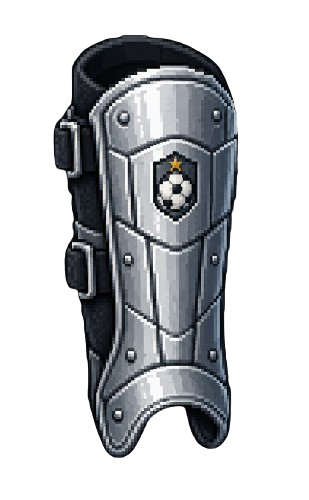 | **Caneleira** | Concede +1 ponto de vida, permitindo ao jogador recuperar     parte da saúde perdida. |
    | 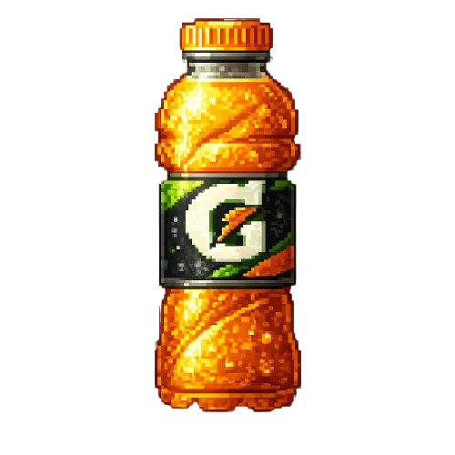 | **Isotônico** | Ativa o Turbo, aumentando a velocidade do personagem e             concedendo imunidade temporária contra obstáculos por alguns segundos. |

    #### 🟥 Obstáculos

    | Obstáculo | Nome | Penalidade / Descrição |
    | :---: | :--- | :--- |
    | 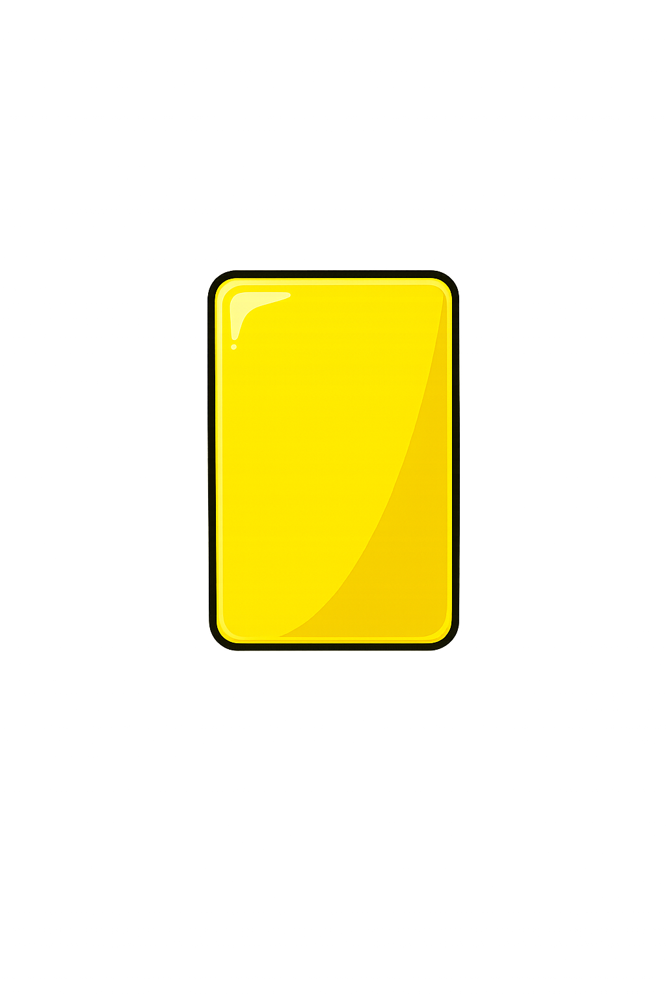 | **Cartão Amarelo** | Reduz 1 ponto de vida ao colidir. |
    | 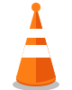 | **Cone** | Reduz 1 ponto de vida ao colidir. |
    | 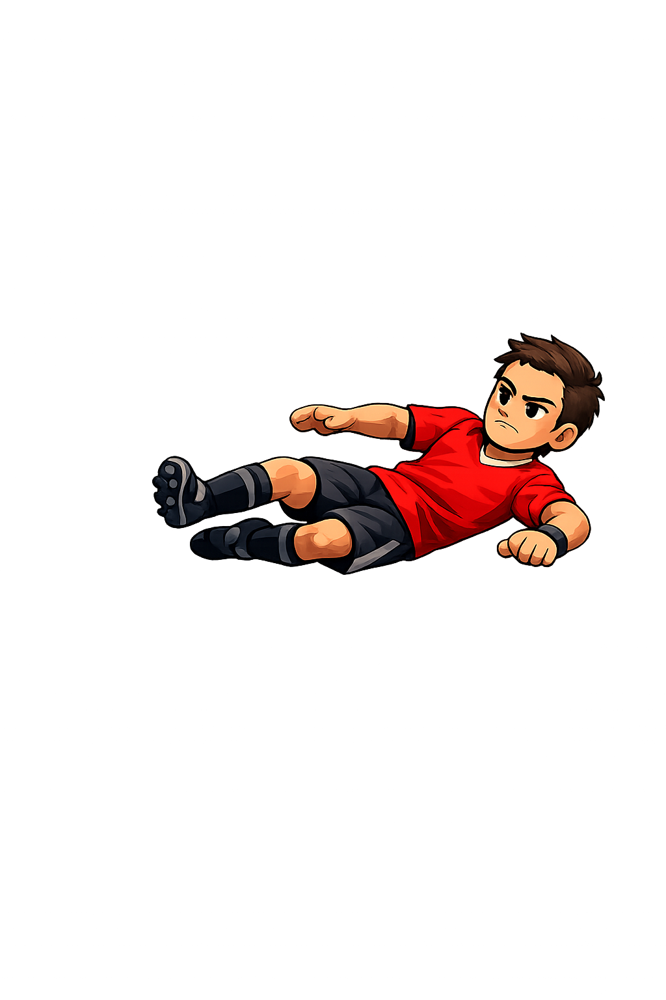 | **Zagueiro** | Reduz 2 pontos de vida ao colidir. |
    | 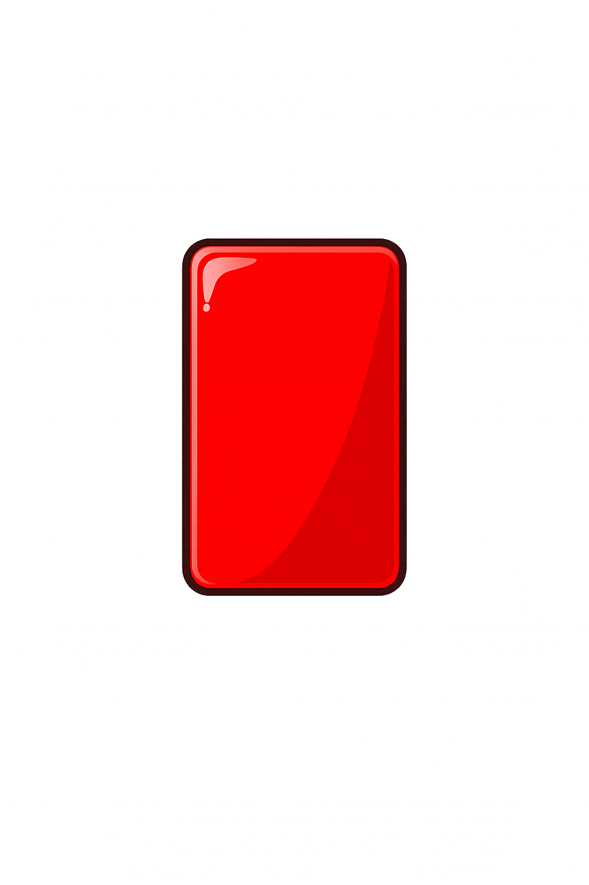 | **Cartão Vermelho** | Reduz 3 pontos de vida ao colidir. |

   * Gerencie suas vidas com cuidado, aproveite os coletáveis estrategicamente e tente alcançar a maior pontuação possível antes que suas vidas acabem.
 
* **Instruções:**
    * Clone ou baixe nosso código no repositório oficial: https://github.com/sfmff/Projeto-IP-grupo-01
    * Rode o arquivo main.py.
    * Aperte F11 para tela cheia.
 

# BOM JOGO E RUMO AO HEXA! 🏆
